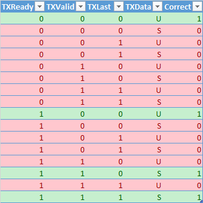

# PyHDL

## Introduction

PyHDL is a library which allowes one to write Python code and convert it to VHDL. The Main Goal of this library is to allow the user to write fully object oriented code.

## Getting Started

### Example1

This Example is shows a single entity with two pocess blocks.

- The First process block (```p1```) is a timed block, which means it gets sequentially executed until it reaches the yield statment and then waits for the appropriate time and then continues the execution. In the context of this example ```p1``` works as a clock generator.
- The Second process block (```p2```) is a triggered process block which gets executed evertime the argument of ```rising_edge``` changes. This Process Block updates a signal (```counter```) amd a variable (```v_counter```). Similarly to VHDL the variable gets changed imidatly but is not avalible for any other process. The signal in contrast gets only changed after the process block but can be used in other process blocks.

```Python
class tb_entity(v_entity):
    def __init__(self):
        super().__init__(__file__)
        self.architecture()


    def architecture(self):
        clk = v_sl()


        @process()
        def p1():

            @timed()
            def proc():
                clk << 1
                print("set clk to 1")
                yield wait_for(10)
                clk << 1
                yield wait_for(10)
                clk << 0
                yield wait_for(10)

        counter = v_slv(32)
        @process()
        def p2():
            v_counter = v_slv(32)
            @rising_edge(clk)
            def proc():
                v_counter << v_counter +1
                counter << counter + 1
                print("counter", counter.value)
                print("v_counter", v_counter.value)
```

The entity can be simulated running the following commands:

```Python
ax = tb_entity()
gsimulation.run_timed(ax, 1000,"example1.vcd")
```

First one needs to create an instants of the entity and then it has to be given as an argument to the simulator alongside the runtime and the output file name. The ouput file can then be viewed with programs like ```GTKWave```.


In Addition the program can be converted to ```VHDL``` using the following command:

```Python
print(ax._get_definition())
```

The output is the following:

```vhdl

entity tb_entity is 
end entity;


architecture rtl of tb_entity is

signal clk : std_logic := '0'; 
signal counter : std_logic_vector(31 downto 0) := (others => '0'); 

begin

  -----------------------------------
  p1 : process
    begin
      clk <= '1';
      wait for  10 ns;
      clk <= '1';
      wait for  10 ns;
      clk <= '0';
      wait for  10 ns;
    end process;
  
  -----------------------------------
  p2 : process(clk) is
    variable v_counter : std_logic_vector(31 downto 0) := (others => '0');
    begin
      if rising_edge(clk) then
        v_counter := v_counter + 1;
        counter <= counter + 1;
      end if;
    end process;
  
end architecture;
```

As one can see the Converted can figure out by itself if a given symbol is a signal or a variable. Also the print statements are currently not supported. Usually if the converter encounters an unknown token it would raise an Exception. For Print there has been written a special module which tells the converter to silently ignore it. 


### Example2

This Example shows how multiple entities can interact with each other. 
1. Clock Generation has been moved to its own entity. 
1. A new entity was introduced that allows to print out data from an axi stream interface. This entity shows the value of the buffer before and after the it has been changed. 
1. the communication between the individual entities is done with classes. With this approach the user does not need to know which signals flow between the different entities. The user can just utilize a library and focus on the actual logic that needs to be implemented. 

```Python
class axiPrint(v_clk_entity):
    def __init__(self,clk=None):
        super().__init__(__file__, clk)
        self.Axi_in = port_Slave(axisStream(32,v_slv(32)))
        self.architecture()

        
    def architecture(self):
        @process()
        def _process1():
            axiSalve = axisStream_slave(self.Axi_in)

            i_buff = v_slv(32)

            @rising_edge(self.clk)
            def proc():
                print("axiPrint",i_buff.value )
                if axiSalve :
                    i_buff << axiSalve
                    print("axiPrint valid",i_buff.value )


class clk_generator(v_entity):
    def __init__(self):
        super().__init__(__file__)
        self.clk = port_out(v_sl())
        self.architecture()

    def architecture(self):
        
        @process()
        def p1():

            @timed()
            def proc():
                self.clk << 1
                print("======================")
                yield wait_for(10)
                self.clk << 0
                yield wait_for(10)


class tb_entity(v_entity):
    def __init__(self):
        super().__init__(__file__)
        self.architecture()
        


    def architecture(self):
        clkgen = v_create(clk_generator())

        Axi_out = axisStream(32,v_slv(32))
        counter = v_slv(32)
        axFil = v_create(axiPrint(clkgen.clk))
        axFil.Axi_in << Axi_out


        @process()
        def p2():
            v_Axi_out = axisStream_master(Axi_out)
            @rising_edge(clkgen.clk)
            def proc():
                if v_Axi_out and counter < 40:
                    print("counter", counter.value)
                    v_Axi_out << counter
                
                    counter << counter + 1
```

This example can be simulated with the following command:

```Py
ax = tb_entity()
gsimulation.run_timed(ax, 1000,"example2.vcd")
```


Each individual entity can be converted to VHDL by using the following command:


```Py
ax = tb_entity()
print(ax._get_definition())
```
The output from this is the following VHDL code:

```VHDL
entity tb_entity is 
end entity;


architecture rtl of tb_entity is

signal clkgen_clk : std_logic := '0'; 
signal Axi_out_m2s : axisStream_32_m2s := axisStream_32_m2s_null;
signal Axi_out_s2m : axisStream_32_s2m := axisStream_32_s2m_null;
signal counter : std_logic_vector(31 downto 0) := (others => '0'); 
signal axFil_Axi_in_m2s : axisStream_32_m2s := axisStream_32_m2s_null;
signal axFil_Axi_in_s2m : axisStream_32_s2m := axisStream_32_s2m_null;

begin
clkgen : entity work.clk_generator port map ( 
      clk => clkgen_clk
  );
  axFil : entity work.axiPrint port map ( 
      Axi_in_m2s => axFil_Axi_in_m2s, 
      Axi_in_s2m => axFil_Axi_in_s2m,
      clk => clkgen_clk
  );
  ---------------------------------------------------------------------
  --  axFil_Axi_in << Axi_out
  axFil_Axi_in_m2s <= Axi_out_m2s;
  Axi_out_s2m <= axFil_Axi_in_s2m;
  
  -----------------------------------
  p2 : process(clkgen_clk) is
    variable v_Axi_out : axisStream_32_master := axisStream_32_master_null;
    begin
      if rising_edge(clkgen_clk) then 
        pull( v_Axi_out, Axi_out_s2m);
    
        if (( ready_to_send(v_Axi_out)  and counter < 40) ) then 
          send_data( v_Axi_out, counter);
          counter <= counter + 1;
          
        end if;
          push( v_Axi_out, Axi_out_m2s);
    end if;
    
    end process;
  
end architecture;
```


### Example 3

This example shows how to incoperate the pipe operator. As it is common in many languages object can have default input output channels. This allows to concatanate entities with a single operation instead of having to connect each signal individually.   

```Python 

class axiFilter(v_clk_entity):
    def __init__(self,clk=None):
        super().__init__(__file__, clk)
        self.Axi_in = port_Slave(axisStream(32,v_slv(32)))
        self._StreamIn = self.Axi_in
        self.Axi_out = port_Master(axisStream(32,v_slv(32)))
        self._StreamOut = self.Axi_out
        self.architecture()

        
    def architecture(self):
        @process()
        def _process1():
            axiSalve = axisStream_slave(self.Axi_in)
            axMaster = axisStream_master(self.Axi_out) 


            i_buff = v_slv(32)
            @rising_edge(self.clk)
            def proc():
                print("axiPrint",i_buff.value )
                if axiSalve and axMaster:
                    i_buff << axiSalve
                    if i_buff < 10:
                        axMaster << axiSalve
                        print("axiPrint valid",i_buff.value )

class axiPrint(v_clk_entity):
    def __init__(self,clk=None):
        super().__init__(__file__, clk)
        self.Axi_in = port_Slave(axisStream(32,v_slv(32)))
        self._StreamIn = self.Axi_in
        self.architecture()

        
    def architecture(self):
        @process()
        def _process1():
            axiSalve = axisStream_slave(self.Axi_in)

            i_buff = v_slv(32)

            @rising_edge(self.clk)
            def proc():
                print("axiPrint",i_buff.value )
                if axiSalve :
                    i_buff << axiSalve
                    print("axiPrint valid",i_buff.value )


class clk_generator(v_entity):
    def __init__(self):
        super().__init__(__file__)
        self.clk = port_out(v_sl())
        self.architecture()

    def architecture(self):
        
        @process()
        def p1():

            @timed()
            def proc():
                self.clk << 1
                print("======================")
                yield wait_for(10)
                self.clk << 0
                yield wait_for(10)


class rollingCounter(v_clk_entity):
    def __init__(self,clk=None,MaxCount=v_slv(32,100)):
        super().__init__(__file__, clk)
        self.Axi_out = port_Master( axisStream(32,v_slv(32)))
        self._StreamOut = self.Axi_out
        self.MaxCount = port_in(v_slv(32,10))
        self.MaxCount << MaxCount
        self.architecture()
    
    def architecture(self):
        
        counter = v_slv(32)
        @process()
        def p2():
            v_Axi_out = axisStream_master(self.Axi_out)
            @rising_edge(self.clk)
            def proc():
                if v_Axi_out:
                    print("counter", counter.value)
                    v_Axi_out << counter
                
                    counter << counter + 1

                if counter > self.MaxCount:
                    counter << 0


class tb_entity(v_entity):
    def __init__(self):
        super().__init__(__file__)
        self.architecture()
        


    def architecture(self):
        clkgen = v_create(clk_generator())

        maxCount = v_slv(32,20)
        axiSource = v_create(rollingCounter(clkgen.clk,maxCount))
        axP       = v_create(axiPrint(clkgen.clk))
        axFilter  = v_create(axiFilter(clkgen.clk))
        
        axiSource | axFilter | axP
        
        end_architecture()
```

This example can be simulated by using the following command:

```Python
ax = tb_entity()
gsimulation.run_timed(ax, 1000,"example3.vcd")
```


The test bench can be converted to VHDL by using the following command:

```Py

print(ax._get_definition())
```


Which results in the following code:

```VHDL
entity tb_entity is 
end entity;


architecture rtl of tb_entity is

signal clkgen_clk : std_logic := '0'; 
signal maxCount : std_logic_vector(31 downto 0) := x"00000014"; 
signal axiSource_Axi_out_m2s : axisStream_32_m2s := axisStream_32_m2s_null;
signal axiSource_Axi_out_s2m : axisStream_32_s2m := axisStream_32_s2m_null;
signal axP_Axi_in_m2s : axisStream_32_m2s := axisStream_32_m2s_null;
signal axP_Axi_in_s2m : axisStream_32_s2m := axisStream_32_s2m_null;
signal axFilter_Axi_out_m2s : axisStream_32_m2s := axisStream_32_m2s_null;
signal axFilter_Axi_out_s2m : axisStream_32_s2m := axisStream_32_s2m_null;
signal axFilter_Axi_in_m2s : axisStream_32_m2s := axisStream_32_m2s_null;
signal axFilter_Axi_in_s2m : axisStream_32_s2m := axisStream_32_s2m_null;

begin
clkgen : entity work.clk_generator port map ( 
      clk => clkgen_clk
  );
  axiSource : entity work.rollingCounter port map ( 
      clk => clkgen_clk,
      Axi_out_m2s => axiSource_Axi_out_m2s, 
      Axi_out_s2m => axiSource_Axi_out_s2m,
      MaxCount => maxCount
  );
  axP : entity work.axiPrint port map ( 
      clk => clkgen_clk,
      Axi_in_m2s => axP_Axi_in_m2s, 
      Axi_in_s2m => axP_Axi_in_s2m
  );
  axFilter : entity work.axiFilter port map ( 
      clk => clkgen_clk,
      Axi_out_m2s => axFilter_Axi_out_m2s, 
      Axi_out_s2m => axFilter_Axi_out_s2m,
      Axi_in_m2s => axFilter_Axi_in_m2s, 
      Axi_in_s2m => axFilter_Axi_in_s2m
  );
  ---------------------------------------------------------------------
  --  axFilter_Axi_in << axiSource_Axi_out
  axFilter_Axi_in_m2s <= axiSource_Axi_out_m2s;
  axiSource_Axi_out_s2m <= axFilter_Axi_in_s2m;
    ---------------------------------------------------------------------
  --  axP_Axi_in << axFilter_Axi_out
  axP_Axi_in_m2s <= axFilter_Axi_out_m2s;
  axFilter_Axi_out_s2m <= axP_Axi_in_s2m;
  
end architecture;
```

### Example 4

```Python
class tb_entity(v_entity):
    def __init__(self):
        super().__init__(__file__)
        self.architecture()

    def architecture(self):
        clkgen = v_create(clk_generator())
        maxCount = v_slv(32,20)
        pipe1  = rollingCounter(clkgen.clk,maxCount)  \
                    | axiFilter(clkgen.clk) \
                    | axiPrint(clkgen.clk)

        end_architecture()
```


```VHDL
entity tb_entity is 
end entity;

architecture rtl of tb_entity is

signal clkgen_clk : std_logic := '0'; 
signal maxCount : std_logic_vector(31 downto 0) := x"00000014"; 
signal pipe1_1_rollingCounter_Axi_out_m2s : axisStream_32_m2s := axisStream_32_m2s_null;
signal pipe1_1_rollingCounter_Axi_out_s2m : axisStream_32_s2m := axisStream_32_s2m_null;
signal pipe1_2_axiFilter_Axi_in_m2s : axisStream_32_m2s := axisStream_32_m2s_null;
signal pipe1_2_axiFilter_Axi_in_s2m : axisStream_32_s2m := axisStream_32_s2m_null;
signal pipe1_2_axiFilter_Axi_out_m2s : axisStream_32_m2s := axisStream_32_m2s_null;
signal pipe1_2_axiFilter_Axi_out_s2m : axisStream_32_s2m := axisStream_32_s2m_null;
signal pipe1_3_axiPrint_Axi_in_m2s : axisStream_32_m2s := axisStream_32_m2s_null;
signal pipe1_3_axiPrint_Axi_in_s2m : axisStream_32_s2m := axisStream_32_s2m_null;

begin
clkgen : entity work.clk_generator port map ( 
      clk => clkgen_clk
  );
  pipe1_1_rollingCounter : entity work.rollingCounter port map ( 
      MaxCount => maxCount,
      clk => clkgen_clk,
      Axi_out_m2s => pipe1_1_rollingCounter_Axi_out_m2s, 
      Axi_out_s2m => pipe1_1_rollingCounter_Axi_out_s2m
  );
    pipe1_2_axiFilter : entity work.axiFilter port map ( 
      clk => clkgen_clk,
      Axi_in_m2s => pipe1_2_axiFilter_Axi_in_m2s, 
      Axi_in_s2m => pipe1_2_axiFilter_Axi_in_s2m,
      Axi_out_m2s => pipe1_2_axiFilter_Axi_out_m2s, 
      Axi_out_s2m => pipe1_2_axiFilter_Axi_out_s2m
  );
    pipe1_3_axiPrint : entity work.axiPrint port map ( 
      clk => clkgen_clk,
      Axi_in_m2s => pipe1_3_axiPrint_Axi_in_m2s, 
      Axi_in_s2m => pipe1_3_axiPrint_Axi_in_s2m
  );
    ---------------------------------------------------------------------
  --  pipe1_2_axiFilter_Axi_in << pipe1_1_rollingCounter_Axi_out
  pipe1_2_axiFilter_Axi_in_m2s <= pipe1_1_rollingCounter_Axi_out_m2s;
  pipe1_1_rollingCounter_Axi_out_s2m <= pipe1_2_axiFilter_Axi_in_s2m;
    ---------------------------------------------------------------------
  --  pipe1_3_axiPrint_Axi_in << pipe1_2_axiFilter_Axi_out
  pipe1_3_axiPrint_Axi_in_m2s <= pipe1_2_axiFilter_Axi_out_m2s;
  pipe1_2_axiFilter_Axi_out_s2m <= pipe1_3_axiPrint_Axi_in_s2m;
  
end architecture;
```


### Axi Stream Interface

This section shows how an interface can be implemented as a pseudo class. For this the Axi Stream Interface is used. This example is used because it is very simple and widly used. The axi stream interface has four signals that are exchanged between master and slave. 

| Name | Direction |
|:--:|:----:|
| Valid | Master To Slave |
| Data | Master To Slave |
| Last | Master To Slave |
|ready | Slave to Master|




Since it has 4 signals and each one can either be set or not set this results in 16 combinations. Only four of these 16 combinations are actual a correct state. All the other ones are undefined behaviour. Programming languages usally solve this problem by not allowing users direct access to the underling data but by providing higher level APIs which provide a safe way of setting states. This APIs safeguard the user in two ways from entering undefined behavior (UB). First if functions are used in the intended fashion the program can never reach an UB state. This should be illustrated with the following example (for details see example 3):  

```Python
if v_Axi_out:
    v_Axi_out << counter
```

In this Example ```v_Axi_out``` is a class which handles the Axi Stream Interface. ```Counter``` is a ```std_logic_vector``` aquivalent variable. The program can only ever reach the assinment when the class ```v_Axi_out``` is True. The user has no (and needs no) further information about the actual implementation of ```v_Axi_out```. The Actual implementation is the responsibility of the library provider. As long as the user always checks if the class is usable the user will never be able to reach UB. 

The second way how APIs protect the user from entering UB is by providing a possibility to check for UB and then report an error to the user. This does not change that the interface is not working correclty but now the system is in an error state (not UB). This information can be used to protect the system from doing any more harm. 

In Addition using a class that encapsulates the interface into one single object prevents the user from ever geting signals mixed up and also vastly improves the readablity of the source code. For Example ```pyHDL``` allows the user to write the information if a given signal is an input or an output directly into the pseudo class:

```Python
class axisStream(v_class):
    def __init__(self,AxiName,Axitype):
        super().__init__("axisStream_"+str(AxiName))
        AddDataType(  Axitype  )
        self.valid  = port_out( v_sl() )
        self.last   = port_out( v_sl() )
        self.data   = port_out( Axitype  )
        self.ready  = port_in( v_sl() )
```

This pseudo class can then be consumed by an entity:

```Python
class axiPrint(v_clk_entity):
    def __init__(self,clk=None):
        super().__init__(__file__, clk)
        self.Axi_in = port_Slave(axisStream(32,v_slv(32)))
```

This makes it very easy to reason about this code. 

In order to use this model in VHDL the pseudo class has to be broken up into two parts. One ```Master to Slave``` (m2s) part and one ```Slave to Master``` (s2m) part. when converting the pseudo class to VHDL the following code will be generated:


```VHDL
type axisStream_32_m2s is record 
  valid : std_logic; 
  data : std_logic_vector(31 downto 0); 
  last : std_logic; 
end record;

constant axisStream_32_m2s_null : axisStream_32_m2s:= (
  valid => '0',
  data => (others => '0'),
  last => '0'
);

type axisStream_32_s2m is record 
  ready : std_logic; 
end record;

constant axisStream_32_s2m_null : axisStream_32_s2m:= (
  ready => '0'
);
```

The consuming entity gets translated into the following VHDL:

```VHDL
entity axiPrint is 
port(
  clk :  in  std_logic := '0';
  Axi_in_m2s : in  axisStream_32_m2s := axisStream_32_m2s_null;
  Axi_in_s2m : out axisStream_32_s2m := axisStream_32_s2m_null
);
end entity;
```


## Object Oriented Desigen for HDL


Virtually all modern programming languages allow the user to write customised objects to build powerful abstraction. The support for this is very limited in typical HDLs. This document is ment to show the limitations of current HDLs and especially how adding an additional layer of abstraction in form of PyHDL can overcome this limitation.


In this document it is assumed that every program can be descriped with three basic building blocks: Responsibility Handler, Data Object and Processor. In programming all names have already been use which makes it exceedingly hard to use terminology that is not alredy used in a different context. For this document only the definition given here should be used.

### **Processor**

The Task of of **processor** is to take an Input and transform it. For example the following function ```f(x) = x^2``` transorms every input by multipling it by itself. Another example of a **processor** would be a factory function which, depening on the input creates differen objects. 

```Py
def factory(x):
    if x == "type_1":
        return type_1()

    elif x == "type_2":
        return type_2()

    # ...    

```

Another example of a **processor** would be a VHDL entity. 

### _Data Object_

The purpose of _Data Objects_ / _Data Structs_ is to store data in an reconizable way. An example would be an object that stores the current time. 

```Py
class time_object:
    def __init(self, time):
        self.time = time
```

The first thing this _data object_ communicates is its purpose. It is designed to store time. (Sure in theory a careless programmer could use it to store the outside temperature in it.) In addition to communicating its purpose it also carries a value. Depening on the development of a given code base the fact that any specefic _data object_ is a time object can be communicated with different mechanims. For example in C++ a common approach would be to just use a typedef which allows the user the convieniece of not having to rewrite all the functions for each new _data object_ while still communicating the purpose of a given object. But if requiered a _data object_ can be a complicated struct with many different members. The important thing is that they all these members would belong logically together. For example the current time can either be stored as unix time or as days, months, years, hours, minutes. In a given context there might be a good reason to store time in days etc. Independend of its implementation a _data object_ communicates its value and its purpose to the user. 

_Data objects_ are usally designed to be very simple and don't contain (much) functionallity. All the funtionallity it provides is to access its value(s). 

With the this two building blocks we can already create our first program:

```Py
tomorow = nextDay( today )
```
with:
tomorow, today... beeing _data objects_ of the type time
nextDay...        beeing a **processor** which takes in time object and returns a new data object for the next day

### Responsibility Handler

The last building block is the Responsibility Handler (RH). Which is used to for example handles the Responsibility of resource managment. Its purpose is for example to allow access to system recsources while at the same time protect the system from wrong use. The classical example would be a file handler or a smart pointer. 


## Limitations of current HDL

### The strict IN/OUT model

Typical HDLs are build up of submodules. In the case of VHDL this submodules are called ```entities```. These ```entites``` are connected to each other by ports. A port can be a single bit (```std_logic```), an array of bits (```std_logic_vector```), a data structure (```record```) or an array of data structure. But no matter how complicated the individual port is, it has always to be labeled as either ```IN``` or ```OUT```. This strict seperation between ```IN``` and ```OUT``` prohibit the creation of more complex objects. How do other languages solve the problem? Lets write the axi stream interface in C++. This example contains two objects which exchange data by sharing a pointer to a common data storage. 

```C++
class axistream;
class source{
public:
    source(axistream * ax);
    void operator()();
private:
    axistream * ax;
};

class destination{
public:
    destination(const axistream * ax);
    void operator()();
private:
    const axistream * ax;
};

class axistream{
public:
    int data;
    bool valid;
    bool last;
    mutable bool ready;
};

auto ax = axistream();
auto my_source = source(ax);
auto my_destination = destination(ax);


while(running()){
    my_source();
    my_destination();
}
```

This example shows that in C++ the direction of the data flow is directly expresst in the _axistream_ class. There is no need to tear apart the individual members of _axistream_. Everything is expresst in the type system of C++. The fact that **source** takes an _axistream_ pointer communicats that **source** wants to modify it. **destination**  takes the _axistream_ as a const pointer which means it wants to consume the data. The mutable keyword communicates that this member will (most) likely be modified by the destination. In this example ready could be modified by two places which is not posibile in HDL. This could be fixed by using some template meta programming technics, which are not part of the scope of this document. The important part is that the _object_ itself carries information about the data flow with it. Translating this to VHDL and we would end up with a construct like this (pseudo syntax):

```VHDL
type axi_Stream  is record 
  data  :  out Integer; 
  valid :  out std_logic; 
  last  :  out std_logic; 
  ready :  in  std_logic; 
end record;


entity source is 
port(
  clk     :  in     std_logic;
  Axi_out : master  axi_Stream;
 
);
end entity;

entity destination is 
port(
  clk     :  in    std_logic;
  Axi_in  : slave  axi_Stream;
 
);
end entity;
```

On every abstraction level this code communicates exactly what is needed to know (and not more). On the record level it shows that it will be used as an interface between two objects. And which of the signals flow in which direction. On the entity level it communicates only if it is a source or a destination. The internal layout of _axi_stream_ does not matter at this point. With the introduction of these new keywords and the possibility to give records directional qualifiers it is possibile to easily create compound objects. For example a bidirectional axi stream can be written as:

```VHDL
type axi_Stream  is record 
  data  :  out Integer; 
  valid :  out std_logic; 
  last  :  out std_logic; 
  ready :  in  std_logic; 
end record;

type axi_Stream_directional  is record 
  TX : master axi_Stream;
  RX : slave axi_Stream;
end record;
```

### Encapsulation

In HDL it is a common aproach to modify signals directly without the procetion of encapsulation. Dependig on the context this approach has been proven to be problematic, especially when there is an invariance to protect. In these cases it has shown to be the safer approach to use (member) function to make the modification. A good example for an invariance that needs to be preserved is the number of elements in a C++ vector. In order to add a new element to a vector there are many steps that have to be done correclty to not destroy the invariance. 

1. checking the size of the vector
1. allocate memory
1. copy elements to new location.
1. Change pointer to point to the new location
1. add the element 
1. update the end pointer
1. ...

All these complicated procedures are completly hidden from the user by the simple ```push_back``` function call. As long as the user does not access the members directly the user will never reach UB. 

What makes this approach so diffecult to achive in HDL is that object are always split up into inputs and outputs. There is not one object that represents an idea there are at least two. In addition VHDL does not allow the creation of member functions. This limitation can be overcome by using free function. 

### Information Hiding / (Compile time) Polymorphism

As described it is a common aporach in HDLs to modify signals directly. In addtion to the already described problem it violates the principle of information hiding and also prohibits any form of polymorphism. Lets take as an example the axi stream interface and the native fifo interface.


These interfaces do exactly the same thing yet they have three different ways of using them. The only thing a user ever would be intressted is:

On master side:
- can i write data
- write data

On the slave side
- can i read data
- read data

This is true for axi stream, native writer and native reader interface. This problem can be solved by providing common interface abstractions. One example from C++ would be the common base class:

```C++
class stream_writer{
    public:
    virtual bool ready() const = 0;
    virtual void write(data_t data) = 0;
};

class stream_reader{
    public:
    virtual bool ready() const = 0;
    virtual data_t read() = 0;
};

class axistream_master : public stream_writer{
public:
    bool ready() const override;
    void write(data_t data) override;
private:
    axi_stream_t ax;
};
```

(Note: In C++, there are many ways of doing anything)

With this approach the details of each interface are hiden from the user. 

### Classes / Combination Of Data and Functions

This section will concentrate on enties and signals. In VHDL entities and signals are instantiated at very different parts of the source file and do not share any visible connection. Therefore it is up to the user to come up with good names that exaclty describe the relationship of each entity and each signal. The next example shows how in C++ this problem solved:

```C++
class axistream{
public:
    int data;
    bool valid;
    bool last;
    mutable bool ready;
};

class source{
public:
    source();
    void operator()();
    const axistream* get_data() const;
private:
    axistream  ax;
};

class destination{
public:
    destination(const axistream * ax);
    void operator()();
private:
    const axistream * ax;
};

auto my_source = source();
auto my_destination = destination(my_source.get_data());

while(running()){
    my_source();
    my_destination();
}
```

In this example **source** owns the _data object_, which makes it much easier to reason about the data flow. Now the line ```auto my_destination = destination(my_source.get_data());``` explains exaclty where the data comes from. It does not depend on a smart naming scheme to communicate this information. Also it can not be done wrong ```my_source.get_data()``` returns a constant pointer. It can only be used in a sink. It cannot accidentally be connected to another source. It will never accidentally return the wrong _data object_. It is correct by design. 

## VHDL Pseudo Classes


## PyHDL Classes
